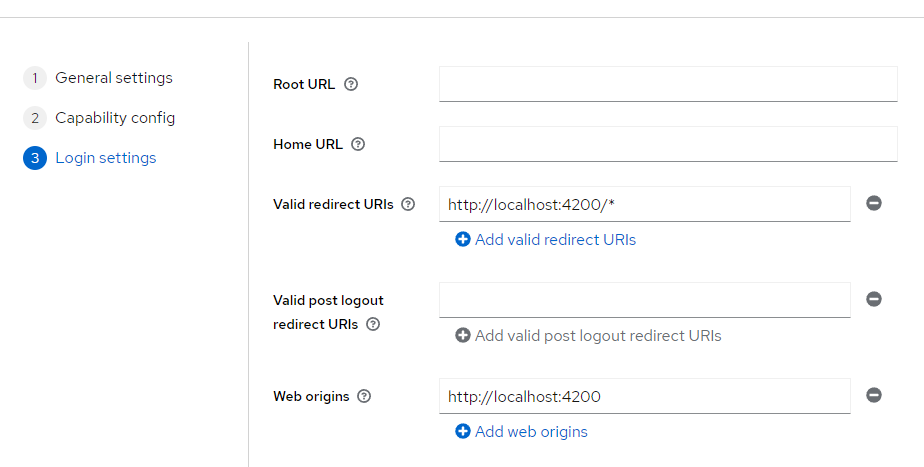

# FrontInventoryA16

This project was generated with [Angular CLI](https://github.com/angular/angular-cli) version 16.1.5.

## Development server

Run `ng serve` for a dev server. Navigate to `http://localhost:4200/`. The application will automatically reload if you change any of the source files.

## Code scaffolding

Run `ng generate component component-name` to generate a new component. You can also use `ng generate directive|pipe|service|class|guard|interface|enum|module`.

## Build

Run `ng build` to build the project. The build artifacts will be stored in the `dist/` directory.

## Running unit tests

Run `ng test` to execute the unit tests via [Karma](https://karma-runner.github.io).

## Running end-to-end tests

Run `ng e2e` to execute the end-to-end tests via a platform of your choice. To use this command, you need to first add a package that implements end-to-end testing capabilities.

## Further help

To get more help on the Angular CLI use `ng help` or go check out the [Angular CLI Overview and Command Reference](https://angular.io/cli) page.

# KeyCloak

se usa para la administracion de servicios dependiendo de los perfiles de usuarios, esta corriendo en el puerto 8082, se configura cuando se instala https://www.keycloak.org/ en este caso se uso con una imagen en docker, para ello se descarga con el siguiente comando:
docker run -p 8082:8080 -e KEYCLOAK_ADMIN=admin -e KEYCLOAK_ADMIN_PASSWORD=admin quay.io/keycloak/keycloak:23.0.6 start-dev
En el puerto 8082 porque el back con spring esta en el 8080, ejecutar la imagen en docker para que este funcional o con el comando (despues de iniciado el docker) docker run (id de la imagen), esto ultimo lo muestra con docker ps
Admin de consola de servicios: http://localhost:8082
En el cual se dio valor general al login con credenciales: admin - admin

## Crear cliente en keycloak:

1- General
2- Capacidad 
3- Login  (redirecciona si el usuario no esta logeado)

## Crear usuarios

1-
2-
3-
4-  (temporal para que cambie la contra)

## Comando para instalar libreria de Keycloack en angular

### https://www.npmjs.com/package/keycloak-angular

npm install keycloak-angular keycloak-js

Configuracion en angular 
